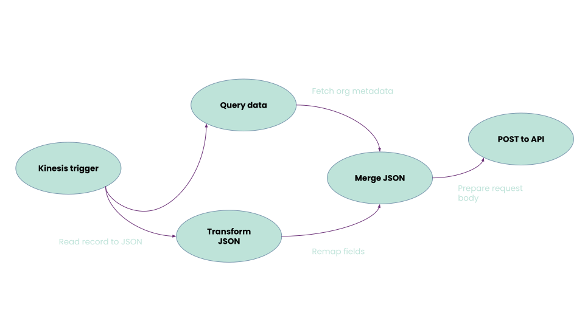
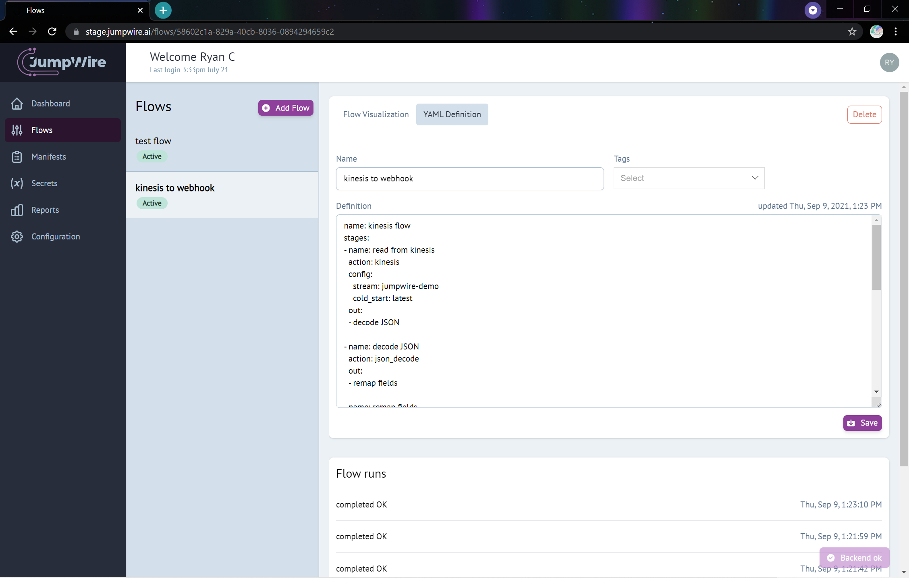
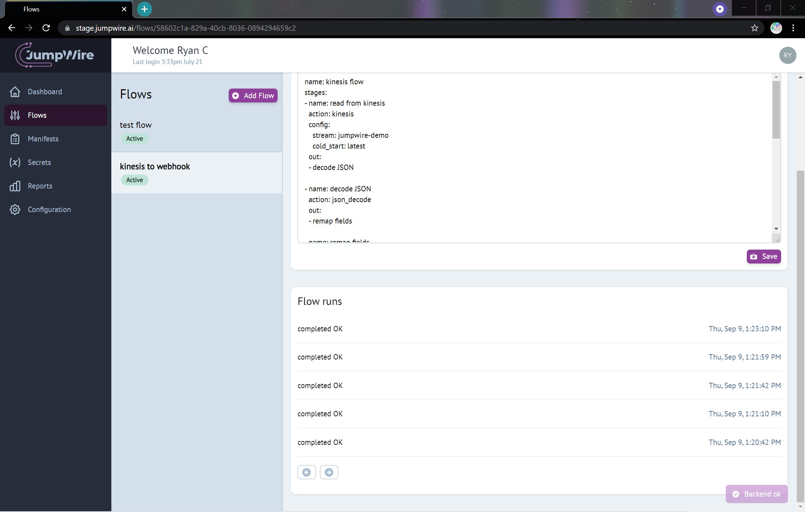

# Flows

A **Flow** is defined as a series of stages for moving data between systems. It starts with a trigger and always completes, typically after transforming data from the trigger and storing or publishing that data. Intermediary stages can filter data to match a criteria, hydrate the data by querying other systems, or add or rename fields. Stages can also fan-out (e.g. map) or combine (e.g. reduce) the results of prior stage executions, allowing for efficient computations.

The most formal definition of a Flow is as a directed acyclical graph ([DAG](https://en.wikipedia.org/wiki/Directed_acyclic_graph)), as Flows must be fully traversable, not contain cycles between stages, and terminate.



## Creating a Flow

Flows are created in the JumpWire app by clicking on the "Add Flow" button on the Flows page. Give the Flow a unique name, add tags as necessary, and enter the Flow YAML in the definition text area.

After succesfully saving a Flow, a graphical visualization can be seen under the tab "Flow Visualization", which displays the sequence of stages by their name and action.



Coming soon
{: .label .label-yellow }

Flows can also be managed in GitHub, to support creating and updating Flows as part of an existing CI/CD pipeline. More details coming soon.

### Flow validation and testing

When a Flow created or updated, JumpWire will test the YAML definition against several validations. This includes ensuring the input is valid YAML, the YAML corresponds to the expected schema (shown below), that each stage of the Flow corresponds to supported stage actions, and that the Flow itself has a valid execution path through all stages.

Coming soon
{: .label .label-yellow }
Flows can also be tested with fixture data input and asserted against expected outputs. This actually executes each stage of the Flow with test data, and any stage that fetches or loads data with external sources can be mocked. Test runs of Flows can ensure that stages are configured correctly and data is being transformed into the right output. Any errors encountered in a test run will cause the validation to fail.

### Flow YAML Definition

All flows can be defined by YAML that corresponds to the following schema. At the top level, a flow is designated by a `name` and list of `stages`, neither of which can be empty.

```yaml
name: Publish to Acme API
stages:
  - trigger stage...
  - transform stage...
  - fetch stage...
  - publish stage...
```

Each stage has required fields for `name`, `action`, `config `and `out`. Names must be unique within a flow, and the values for `action` and `config` reserved depending on the type of stage.

The `out` field indicates a list of names of stages that should receive as input the output of this stage. This is how the directed edges of the graph are defined for the Flow. There may be multiple stage names listed under `out`, and each of those stages will receive the same output. In the case of a terminal stage, the `out` field can be omitted. For a complete description of the YAML definition of stages, please see the [flow stages page](stages)

In the example below, the stage "Decode JSON" decodes binary data into a JSON string sends that JSON string to two subsequent stages, which both receive the JSON as input.

```yaml
name: Handle some JSON like it's hot
stages:
  - name: Decode JSON
    action: json_decode
    out:
    - Subsequent stage name 1
    - Sebsequent stage name 2

  - name: Subsequent stage name 1
    ...

  - name: Subsequent stage name 2
    ...
```

## Flow runs and triggers

Each execution of a Flow is called a "run", and Flows must declare a stage that triggers the start of a fun. Triggers can be scheduled like a cron job, invoked through a webhook, subscribe to events on streams, or capture change data.

The status of each stage's execution can be seen in real time in the JumpWire web app, under the Flow definition. Flow runs must complete, either in success or error, and each flow run is recorded and timed by default.



For a complete list of Flow stages and their capabilities, please see the [flow stages page](stages)

## Complete Flow Schema

All Flow YAML definitions must conform to the following JSON schema:

```json
{
  "$schema": "http://json-schema.org/draft-07/schema#",
  "additionalProperties": false,
  "definitions": {
    "stage": {
      "additionalProperties": false,
      "properties": {
        "action": {
          "description": "The name of the action this stage will perform. The name could be custom to identify this stage, or correspond to a packaged stage.",
          "type": "string"
        },
        "config": {
          "additionalProperties": true,
          "description": "Configuration to pass to the action.",
          "properties": {},
          "type": "object"
        },
        "name": {
          "description": "Uniquely identify the stage within a Flow",
          "type": "string"
        },
        "out": {
          "description": "List of output stage names.",
          "items": {
            "type": "string"
          },
          "type": "array"
        }
      },
      "required": ["action", "name"],
      "type": "object"
    }
  },
  "properties": {
    "name": {
      "description": "Uniquely identify the Flow",
      "type": "string"
    },
    "stages": {
      "description": "List of stages for the Flow",
      "items": {
        "$ref": "#/definitions/stage"
      },
      "type": "array"
    }
  },
  "required": ["name", "stages"],
  "type": "object"
}
```
