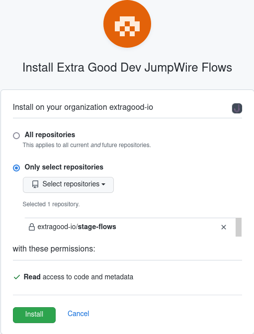

## GitHub Integration

Flow definitions can be managed with git and automatically synchronized from GitHub.

### Requirements

For webhooks to function, the JumpWire frontend must be accessible to [GitHub IP addresses](https://docs.github.com/en/authentication/keeping-your-account-and-data-secure/about-githubs-ip-addresses) on port 443. The frontend must also be using a publicly resolvable DNS name with a valid TLS certificate.

### Initial setup

These steps will create a GitHub App in your GitHub account or organization.

In the JumpWire **Configuration** page, enter the name of your GitHub organization and click Connect. If the organization name is left blank, the GitHub app will be installed to your personal GitHub account instead.

You will be redirected to GitHub. Change the app name if desired and create it. NOTE: GitHub requires that the app name is globally unique. After creation, the app needs to be installed on at least one repo. Select the repo containing your flow definitions and click Install.

### Usage

JumpWire will synchronize flow definitions from the repository selected for the GitHub App. On each git push, JumpWire will receive a webhook event and fetch all yaml files from the root directory of the repo. Each file will create a single flow, or update an existing flow if a match is found.

Flows are not automatically deleted. If a flow is deleted from git, it must be manually deleted from JumpWire.

Changing the filename will break the linkage with the flow and cause a new flow to be created.
