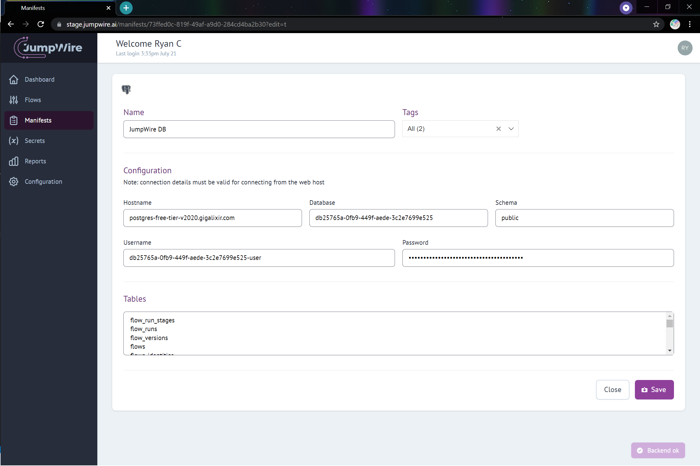
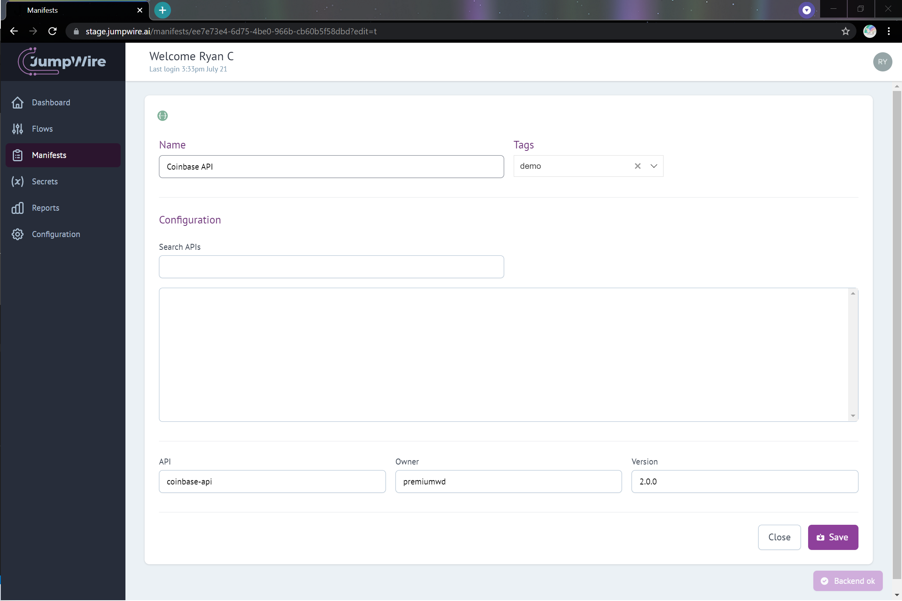

## Manifests

A Manifest describes a resource that is external from JumpWire. Examples include databases, Swagger docs, JSON schemas, cloud services, or third-party connectors.

By configuring Manifests, JumpWire can automate the collection or publishing of data to and from data sources, and in many cases, catalog the structure of data directly from the schemas of data sources.

Manifests fulfill two purposes in JumpWire - they contain details necessary for creating connections to external systems such as databases, and can often describe the schemas of data in those systems depending on the type of system being connected.

Manifests are uniquely identified by their name.

Coming soon
{: .label .label-yellow }

Please note, much of the functionality of Manifests is still under construction. In future versions, JumpWire will use Manifests as part of Flow definitions, enforce data types and structs, provide AI assistance for writing Flows, and automatically apply data handling policies based on tags.

### Manifest types

#### PostgreSQL

Details for connecting to a PostgreSQL database. All fields in the table below are required. Upon successful connection, an input box will list the tables in the database.

| Connection field name | Description                                                    |
| --------------------- | -------------------------------------------------------------- |
| Hostname              | The host of the PostgreSQL server                              |
| Database              | The name of the PostgreSQL database to connect to              |
| Schema                | The name of the schema containing tables to list and describe  |
| Username              | The username to use when connecting to the database server     |
| Password              | A valid password to use when connecting to the database server |

Here is an example connecting to the JumpWire application's own database:

#### SwaggerHub

Search SwaggerHub's list of APIs and create a Manifest from the swagger doc listed for the API. Type a term in the "Search APIs" box, and select a result by it's name. The SwaggerHub API name, Owner and Version will be filled in to the rest of the form. Alternatively, those fields can be entered manually.

| Connection field name | Description                              |
| --------------------- | ---------------------------------------- |
| API                   | The name of the API in SwaggerHub        |
| Owner                 | The name of the owner of the swagger doc |
| Version               | The version of the API/swagger doc       |

Here is an example selecting a SwaggerHub entry for the Coinbase API:

