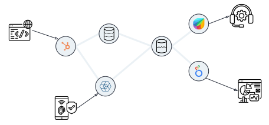

## Welcome to JumpWire

JumpWire is an integration platform that connects internal data to vendor APIs. The best use cases for JumpWire are those where data stored in private databases must be exchanged with third parties. Since JumpWire is designed to be easily self-hosted, the data passing through JumpWire never leaves local networks, and the internal systems JumpWire connects do not need to open connections to the internet. This stands in contrast of hosted integration platforms, which exposes data and connections to an intermediate system.

JumpWire also enforces data handling in a consistent manner across connections to third-party APIs. This is especially useful for scenarios where sensitive data, such as PII, is being shared but some fields, for example social security numbers, must be redacted before sharing. Regardless of where a SSN might appear across different databases, JumpWire can ensure it is always tokenized before sharing externally.

JumpWire creates a graph of logcial steps between data sources and destinations. Each step can manipulate the data passing through it, and steps combine to create powerful transformations to the data.

The execution of graph steps are distributed across a cluster of servers, allowing JumpWire to scale linearly. Each step, called a "stage", can recover from failures without affecting the performance of the overall system.

In this documentation, we present the major concepts in JumpWire along with instructions for building execution graphs, called "flows", and configuring self-hosted deployments.

### Terminology

JumpWire defines several terms for managing the entire lifecycle of data integrations.

The sequence of steps for transforming and exchanging data are called ["Flows"](/jumpwire-docs/docs/flows). Each Flow has one or more triggers that provide input data, and each step must complete successfully before the next step is started.

Individual steps of a Flow are called ["Stages"](/jumpwire-docs/docs/flows/stages). JumpWire provides pre-built stages for common methods of data manipulation.

Connections to systems are defined as ["Manifests"](/jumpwire-docs/docs/manifests). In many cases, a Manifest can also catalogue the schema of data in a given system.

Variables that can be externalized and passed into Flows are called ["Secrets"](/jumpwire-docs/docs/secrets). Secrets can also be used to store connection or authentication parameters.

### Deployment

The recommended method for deploying JumpWire is to be self-hosted directly inside your cloud. JumpWire makes this easy by providing templates and charts for AWS and Kubernetes, as well as pre-built containers for other orchestration platforms.

Deployment templates come with sane defaults, and all options are listed at [Deployments](/jumpwire-docs/docs/deployments)

### Next steps

To get started with JumpWire, become familiar with the following JumpWire concepts:

- [Flows](flows)
- [Manifests](manifests)
- [Secrets](secrets)

### Get help

You can reach out to the developers of JumpWire by email -- ryan _at_ jumpwire.ai \|\| william _at_ jumpwire.ai
